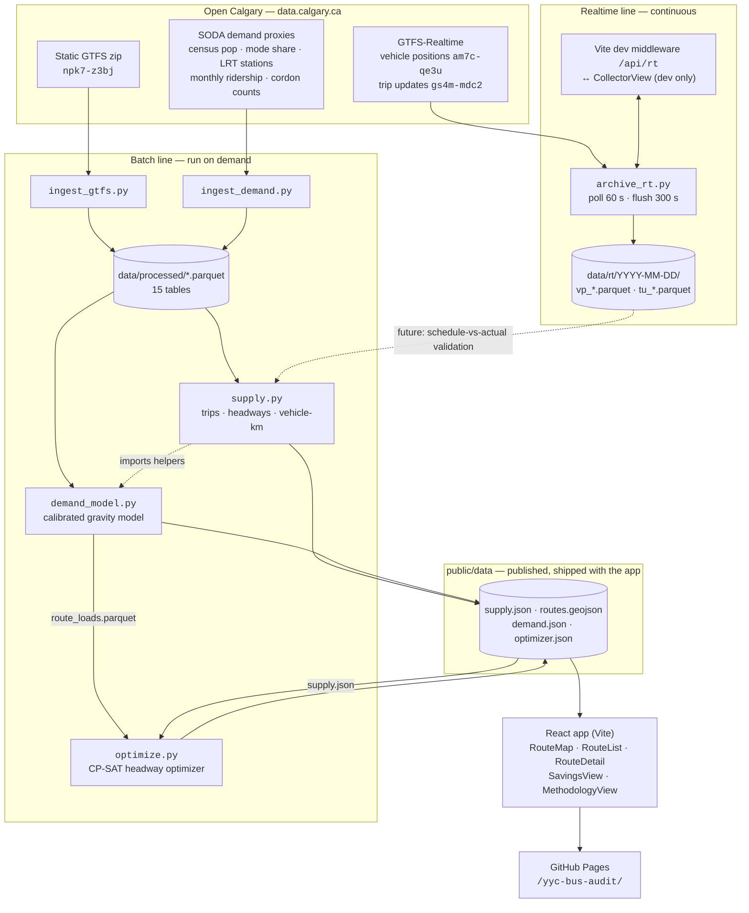

# Pipeline Architecture

Everything runs locally as plain Python scripts against Open Calgary data.
A **batch line** turns the published schedule into supply, demand, and
optimizer results served as static JSON; a **realtime line** archives
GTFS-RT feeds for later validation. No database, no backend — the deployed
app is files on GitHub Pages.

## System diagram



## Batch line

Numbered by run order. Shared paths, dataset IDs, and service-period
definitions live in `common.py`.

1. **`ingest_gtfs.py`** — downloads the GTFS zip (cached at
   `data/raw/CT_GTFS.zip`) and converts every table to parquet, keeping IDs
   as strings and parsing `>24:00` times for after-midnight trips.
   → `data/processed/{routes,trips,stop_times,shapes,stops,calendar,calendar_dates,agency}.parquet`

2. **`ingest_demand.py`** — fetches the SODA CSVs (cached in
   `data/raw/demand/`), joins 2021 population with 2016 transit share per
   community (median-imputed where missing, flagged), and normalizes the
   ridership and cordon series. Independent of step 1 — either order works.
   → `data/processed/{communities,lrt_stations,ridership_monthly,cordon}.parquet`

3. **`supply.py`** — from the schedule alone: per route × service period ×
   day type, computes trips, headways, **vehicle-km (the fuel proxy)**, peak
   vehicles, and speeds; finds overlapping corridors with buffered shape
   geometry; flags optimization candidates.
   → `public/data/supply.json`, `public/data/routes.geojson`

4. **`demand_model.py`** — no per-stop ridership is published, so demand is
   *modeled*: a calibrated gravity model (population within 400 m × transit
   share × downtown attraction × LRT-feeder bonus), spread over canonical
   hour-of-day curves and scaled to match published monthly bus boardings.
   Three scenarios bound the honesty range. Imports period/service-date
   helpers from `supply.py`.
   → `data/processed/{stop_demand,route_loads}.parquet`, `public/data/demand.json`

5. **`optimize.py`** — CP-SAT picks a headway per (route, period, day type) —
   never shorter than today's — maximizing vehicle-km saved under capacity,
   availability, service-standard, and **ridership-loss budget** constraints.
   Reads `supply.json` (step 3) and `route_loads.parquet` (step 4); the
   conservative scenario is the headline number.
   → `data/processed/optimized_headways.parquet`, `public/data/optimizer.json`

6. **React app** (`src/`) — `lib/data.js` fetches and joins the four
   published files at load. Vite build deploys `dist/` to GitHub Pages at
   `/yyc-bus-audit/` — purely static, no server.

## Realtime line

- **`archive_rt.py`** — long-running collector (launchd-friendly): polls
  both protobuf feeds every 60 s, skips duplicate feed timestamps, flushes
  to per-day parquet every 300 s, and rewrites a `data/rt/status.json`
  heartbeat after every poll.
- **Control plane** — dev-only Vite middleware exposes
  `/api/rt/{status,log,start,stop}`; the CollectorView tab in the same
  React app starts/stops the collector and shows its heartbeat and log.
  The collector is its own process and outlives the dev server.
- **Future** — the archive exists to check modeled and scheduled figures
  against observed operations. Not yet wired into the published outputs;
  the batch line runs without it.

## Run order

```sh
# one-time / on feed refresh — steps 1–2 in any order
python ingest_gtfs.py && python ingest_demand.py

# analysis — order matters (4 imports from 3; 5 reads outputs of 3 and 4)
python supply.py && python demand_model.py && python optimize.py

# realtime collector — its own process, controlled from the Collector tab in dev
python archive_rt.py

# ship
npm run build   # dist/ → GitHub Pages at /yyc-bus-audit/
```

Each analysis script has a matching test module (`test_supply.py`,
`test_demand.py`, `test_optimize.py`).
